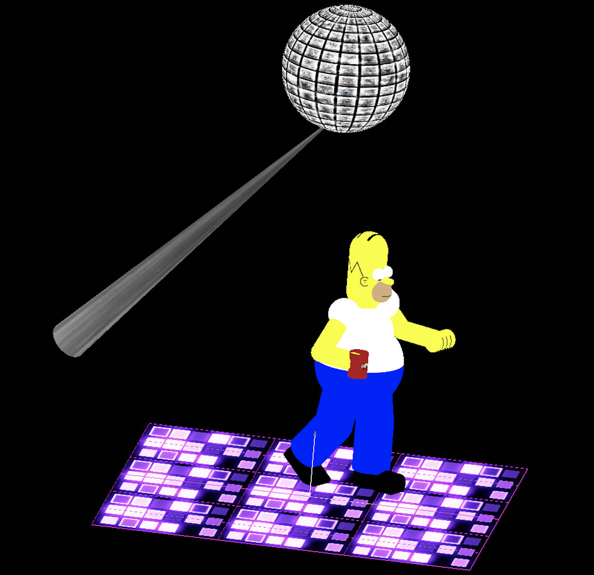

# Homer Simpson Dancing



An interactive animation written in OpenGL wherein Homer Simpson dances.

### Usage:

Clone respository:

```
git clone https://github.com/FrancisLawlor/HomerSimpson_OpenGL.git
```

Import project to [Qt Creator](http://doc.qt.io/qtcreator) and run.
